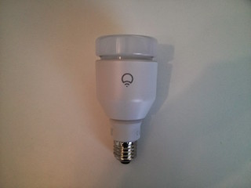

# LIFX Binding

This binding integrates the [LIFX LED Bulb](http://www.lifx.com/). All LIFX bulbs are directly connected to the WLAN and the binding communicates with them over a UDP protocol.



## Supported Things

The binding was mainly developed for the E27 original LIFX bulb. Other bulbs like the GU10 model are not tested, but should also be supported. 

## Discovery

The binding is able to auto-discover all bulbs in a network over the LIFX UDP protocol. Therefore all bulbs must be turned on.

*Note:* To get the binding working, all bulbs must be added to the WLAN network first with the help of the [LIFX smart phone applications](http://www.lifx.com/pages/go). The binding is NOT able to add or detect bulbs outside the network.

## Thing Configuration

Each bulb needs the device ID as configuration parameter. The device ID is printed as serial number on the bulb and can also be found within the native LIFX Android or iOS application. But usually the discovery works quite reliable, so that a manual configuration is not needed.

However, in the thing file, a manual configuration looks e.g. like

```
Thing lifx:light:light1 [ deviceId="D073D5010E20" ]
```

## Channels

The bulb only supports the color channel:

| Channel Type ID | Item Type    | Description  |
|-----------------|------------------------|--------------|----------------- |------------- |
| color | Color       | This channel supports full color control with hue, saturation and brightness values. |


## Full Example

demo.things:
```
Thing lifx:light:light1 [ deviceId="D073D5010E20" ]
```

demo.items:
```
Color Light { channel="lifx:light:light1:color" }
```

demo.sitemap:
```
sitemap demo label="Main Menu"
{
	Frame {
		Colorpicker item=Light
	}
}
```
